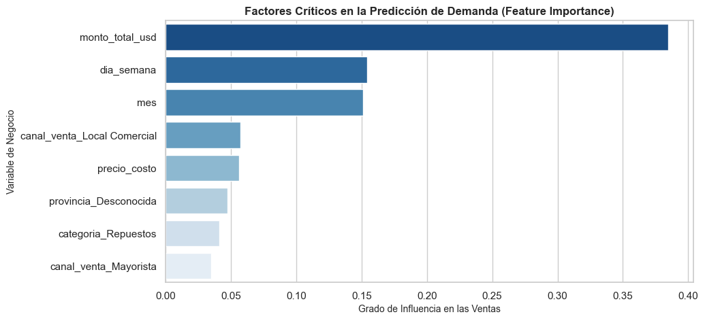

# SQL_ETL_MachineLearning_DemandPrediction
# Pipeline de datos relacionales con SQLite, limpieza ETL y modelo Random Forest para predicción de demanda de inventario.
# 📦 02. SQL, ETL Pipeline & Machine Learning Demand Prediction

## 📌 Executive Summary
End-to-end Data Engineering and Machine Learning project focused on supply chain optimization. The project extracts raw sales data from relational databases using SQL, executes an ETL pipeline to fix operational anomalies, and applies supervised ML to forecast product demand.

## 🏗️ Technical Architecture
1. **Relational Data Extraction:** Connected via `sqlite3` to pull transactional tables.
2. **ETL & Data Wrangling:** Handled null values, corrected negative unit prices, and normalized date attributes.
3. **Feature Engineering:** Extracted temporal signals (day of week, month) and calculated historical aggregations.
4. **Predictive Modeling:** Trained a `RandomForestRegressor` to forecast SKU-level demand.

## 📊 Business Impact & Key Metrics
- **Feature Importance:** Identified that transactional dollar volume (~40%) and day-of-week seasonality (~15%) are the main drivers of inventory movement.
- **Accuracy:** Reduced demand forecast error down to **1.34 units per order**, minimizing stockout risks and holding costs.

## 🛠️ Tech Stack
- **Database:** SQLite3 / SQL
- **Language & Libraries:** Python 3.14, Pandas, NumPy, Scikit-Learn, Matplotlib, Seaborn

